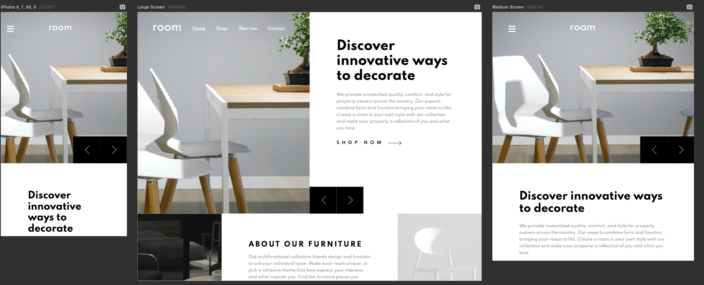

# Frontend Mentor - Room homepage solution

This is a solution to the [Room homepage challenge on Frontend Mentor](https://www.frontendmentor.io/challenges/room-homepage-BtdBY_ENq). Frontend Mentor challenges help you improve your coding skills by building realistic projects. 

## Table of contents

- [Overview](#overview)
  - [The challenge](#the-challenge)
  - [Screenshot](#screenshot)
  - [Links](#links)
- [My process](#my-process)
  - [Built with](#built-with)
  - [What I learned](#what-i-learned)
  - [Continued development](#continued-development)
  - [Useful resources](#useful-resources)
- [Author](#author)

## Overview

### The challenge

Users should be able to:

- View the optimal layout for the site depending on their device's screen size
- See hover states for all interactive elements on the page
- Navigate the slider using either their mouse/trackpad or keyboard

### Screenshot




### Links

- Solution URL: [room-homepage](https://github.com/Patrick-Koppe/frontend-mentor-ecommerce-homepage/tree/master/room-homepage)
- Live Site URL: [https://frontendmentorecommercehomepag.gatsbyjs.io/](https://frontendmentorecommercehomepag.gatsbyjs.io/)

## My process

### Built with

- [gatsby.js](https://www.gatsbyjs.com/) - React framework
- [React-bootstrap](https://react-bootstrap.github.io/) - CSS Framework
- [Bootstrap 5](https://getbootstrap.com/) - CSS (Grid) Framework

### What I learned

```js
  // Toggle classes by click event inside a component to the parent one.
  const [open, setOpen] = useState(true);

  const handleMenuClick = (open) => {
    setOpen(!open);
  }

  <MainMenu open={open} onMenuClick={handleMenuClick} />
```

### Continued development

Built more projects with [gatsby.js](https://www.gatsbyjs.com/) and use different gatsbyjs plugins like [gatsby-plugin-breakpoints](https://www.gatsbyjs.com/plugins/gatsby-plugin-breakpoints/).


### Useful resources

- [gatsby.js](https://www.gatsbyjs.com/) - This helped me for fast developing and learning projects with [React](https://reactjs.org/). 
- [Bootstrap 5](https://getbootstrap.com/) - An amazing framework to get a fast responsive website with predefined styles, (color-) variables and Scss (mixin-) functions.

## Author

- Website - [Patrick Koppe](https://patrickkoppe.de)
- Frontend Mentor - [@Patrick.Koppe](https://www.frontendmentor.io/profile/Patrick.Koppe)
